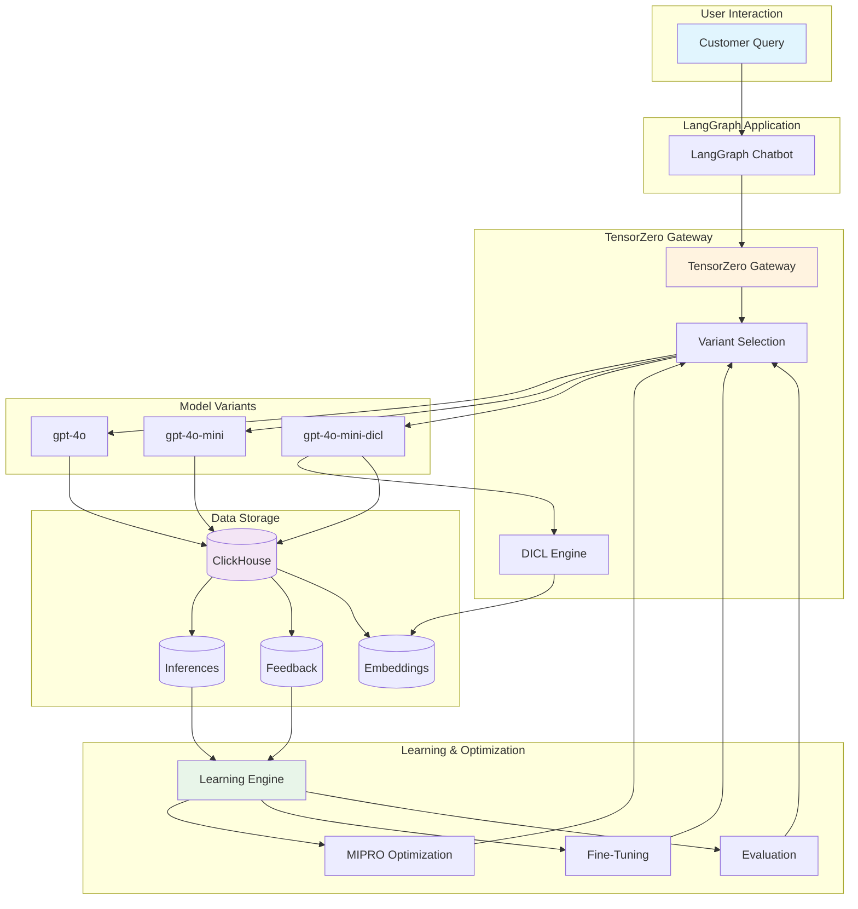
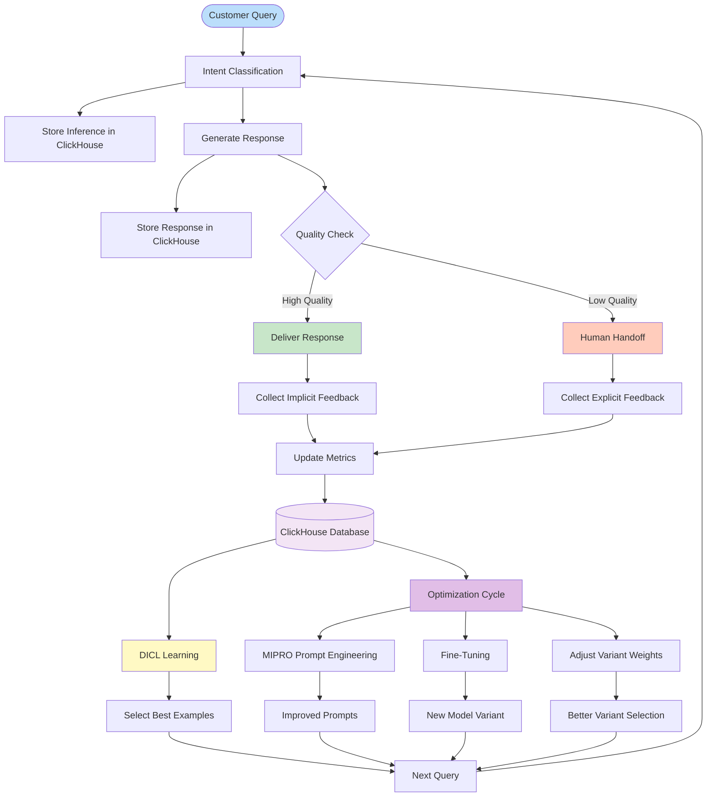
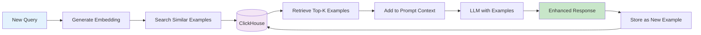
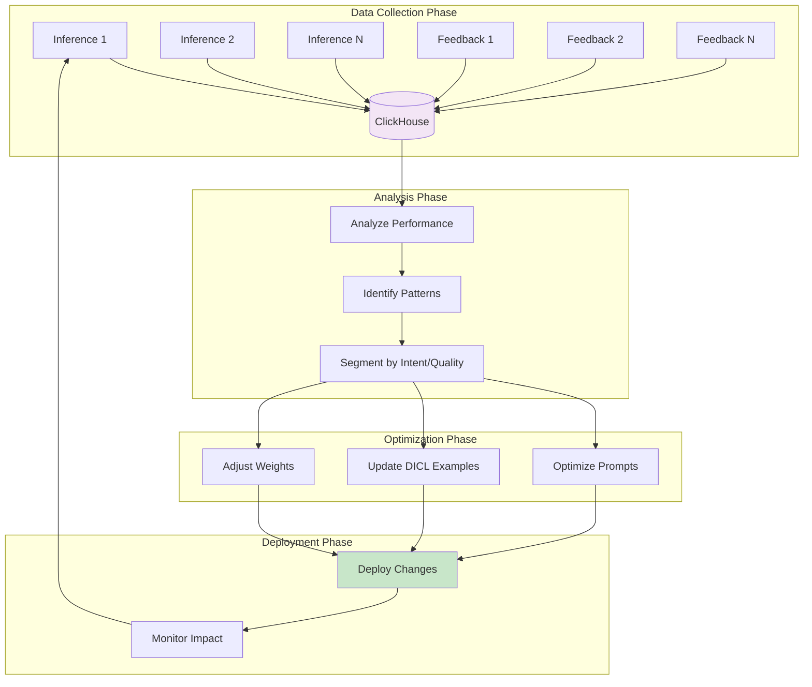
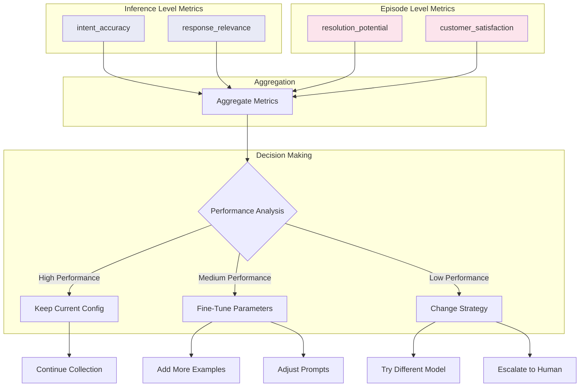
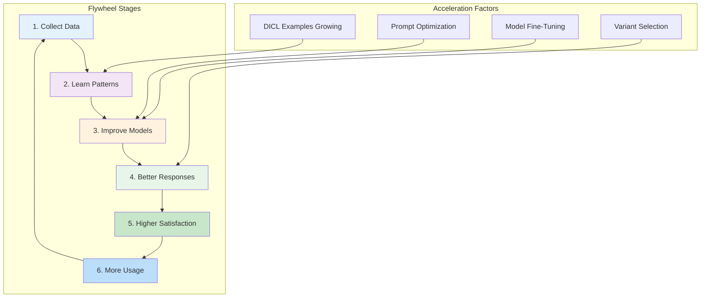
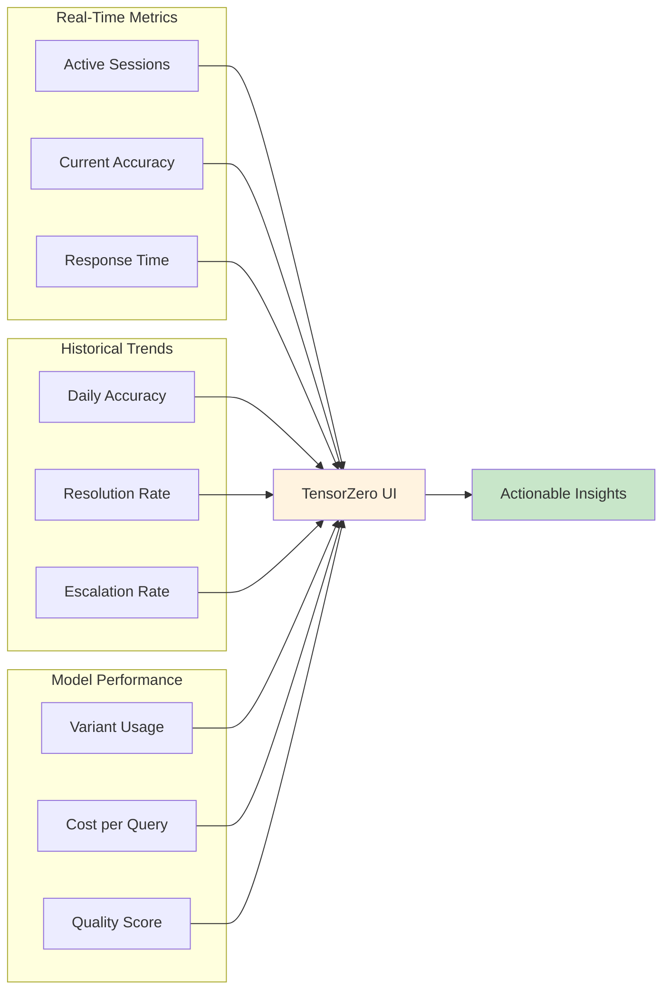

# TensorZero Feedback Loop & Learning Flywheel

## Architecture Overview

## Detailed Feedback Loop Flow

## Real-Time Learning Components

### 1. Immediate Learning (DICL)

### 2. Continuous Optimization

## Feedback Metrics Flow

## Learning Flywheel Effect

## Implementation Timeline

```mermaid
gantt
    title TensorZero Learning Evolution
    dateFormat X
    axisFormat %s
    
    section Phase 1
    Baseline Collection    :0, 10
    Initial DICL Setup     :5, 10
    
    section Phase 2
    DICL Learning          :10, 20
    Feedback Collection    :10, 25
    
    section Phase 3
    MIPRO Optimization     :20, 10
    Prompt Refinement      :25, 10
    
    section Phase 4
    Fine-Tuning            :30, 15
    Model Deployment       :40, 5
    
    section Continuous
    Monitoring             :0, 45
    Improvement            :10, 35
```

## Key Benefits of the Feedback Loop

### 1. **Real-Time Adaptation**
- DICL immediately uses successful interactions as examples
- No retraining required for basic improvements
- Examples are selected based on semantic similarity

### 2. **Progressive Enhancement**
- Start with baseline models
- Collect performance data
- Optimize prompts with MIPRO
- Fine-tune models when sufficient data

### 3. **Automatic Quality Improvement**
- System learns from both successes and failures
- Human feedback incorporated automatically
- Variant weights adjust based on performance

### 4. **Cost Optimization**
- Use cheaper models when quality is sufficient
- Reserve expensive models for complex queries
- DICL enhances cheaper models with examples

## Metrics Dashboard View

## Summary

The TensorZero feedback loop creates a self-improving system where:

1. **Every interaction contributes** to the knowledge base
2. **DICL provides immediate improvements** without retraining
3. **Continuous optimization** happens in the background
4. **Multiple learning mechanisms** work in parallel
5. **The system gets smarter** with each query

This creates a powerful flywheel effect where better responses lead to more usage, which provides more data, leading to even better responses.